```mermaid
flowchart TD
    A([Start]) --> B[/Input number/]
    B --> C[i ← 1]
    C --> D{Is i ≤ 10?}
    D -->|Yes| E[/Print number × i/]
    E --> F[i ← i + 1]
    F --> D
    D -->|No| G([End])
```

```mermaid
flowchart TD
    A([Start]) --> B[/Input average_marks/]
    B --> C{Is average ≥ 50?}
    C -->|Yes| D[/Print "Pass"/]
    C -->|No| E[/Print "Fail"/]
    D --> F([End])
    E --> F
```

```mermaid
flowchart TD
    A([Start]) --> B[/Input number/]
    B --> C[Set factorial = 1]
    C --> D[Set i = 1]
    D --> E{Is i ≤ number?}
    E -->|Yes| F[factorial = factorial * i]
    F --> G[i = i + 1]
    G --> E
    E -->|No| H[/Print factorial/]
    H --> I([End])

```

# Workshop: Algorithm and Flowchart

For each question in this workshop, you must complete **two** things:

1.  **Write the pseudocode**
2.  **Draw the flowchart** using either
    - **Option 1:** Draw.io (recommended) → export image → upload to
      your repository → link it in this file
    - **Option 2 (optional):** Write a Mermaid flowchart directly in
      Markdown
    - **Option 3 (optional):** Any other valid method

👉 **IMPORTANT:** At the **bottom of each question**, add the
following sections:

### ✔ Pseudocode

### ✔ Flowchart

---

## 1. Check Even or Odd Number

Design an algorithm and flowchart that take a number as input and
determine whether it is even or odd.

### ✔ Pseudocode

```text
START
    INPUT number
    IF number % 2 == 0 THEN
        PRINT Even
    ELSE
        PRINT Odd
    ENDIF
END
```

### ✔ Flowchart


---

## 2. Calculate Total and Average Marks

Write the algorithm and draw the flowchart for a program that inputs
marks for 3 subjects, calculates the total and average, and displays
both.
```text

Start
Input mark1, mark2, mark3
total < mark1 + mark2 + mark3average < total / 3
Print < total, average
End


```


### ✔ Flowchart

---

## 3. Display Multiplication Table

Create an algorithm and flowchart that input a number and display its
multiplication table from 1 to 10 using a loop.
```text

START
    INPUT number
    FOR i FROM 1 TO 10 DO
        PRINT number × i
    ENDFOR
END


```


### ✔ Flowchart

---

## 4. Positive, Negative, or Zero Check

Write the algorithm and flowchart to input a number and display whether
it is positive, negative, or zero.
```text

START
    INPUT number
    IF number > 0 THEN
        PRINT "Positive"
    ELSE IF number < 0 THEN
        PRINT "Negative"
    ELSE
        PRINT "Zero"
    ENDIF
END


```


### ✔ Flowchart

---

## 5. Simple Interest Calculator

Create an algorithm and flowchart for a program that calculates simple
interest using the formula:

**SI = (P × R × T) / 100**

- **P = Principal** → original amount of money
- **R = Rate of Interest** → percentage per year
- **T = Time** → number of years

```text

START
    INPUT P, R, T
    SI ← (P × R × T) / 100
    PRINT SI
END


```


### ✔ Flowchart

---

## 6. Average Temperature Calculation

Write the algorithm and draw the flowchart for a program that takes the
temperature of 7 days, finds the average temperature, and displays it.
```text

START
    SET sum < 0
    FOR day FROM 1 TO 7 DO
        INPUT temperature
        sum < sum + temperature
    END FOR
    average < sum / 7
    PRINT average
END


```


### ✔ Flowchart

---

## 7. Calculate Area of a Rectangle

Create an algorithm and flowchart to input length and width, calculate
the area (**Area = Length × Width**), and display the result.
```text

START
    INPUT length, width
    area < length * width
    PRINT area
END


```


### ✔ Flowchart

---

## 8. Determine Pass or Fail

Write the algorithm and draw the flowchart for a program that takes a
student's average marks and displays **"Pass"** if average ≥ 50,
otherwise **"Fail"**.
```text
Start
  input average_marks
  If average_marks > 50 Then
  Print "pass"
  Else
  Print "Fail"
  End if
End
```
### ✔ Flowchart


---

## 9. Calculate Factorial of a Number

Write the algorithm and draw the flowchart that input a number and
calculate its factorial using a loop.
```text
START
    INPUT number
    SET factorial ← 1
    FOR i FROM 1 TO number DO
        factorial ← factorial * i
    END FOR
    PRINT factorial
END

```
### ✔ Flowchart

---

## 10. Calculate Discount on Purchase

Write the algorithm and draw the flowchart for a program that inputs the
purchase amount and gives a **10% discount** if the amount is greater
than 1000.
```text
START
    INPUT purchase_amount
    IF purchase_amount > 1000 THEN
        discount < purchase_amount * 0.10
        final_amount < purchase_amount - discount
    ELSE
        final_amount < purchase_amount
    END IF
    PRINT final_amount
END


```
### ✔ Flowchart

---
